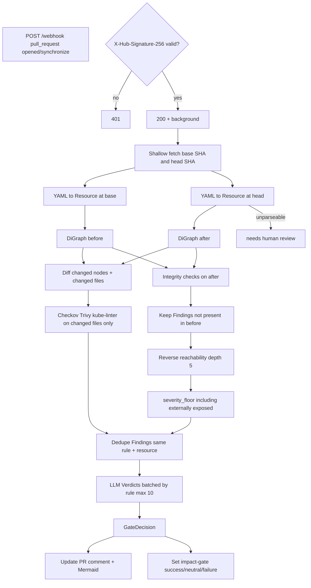
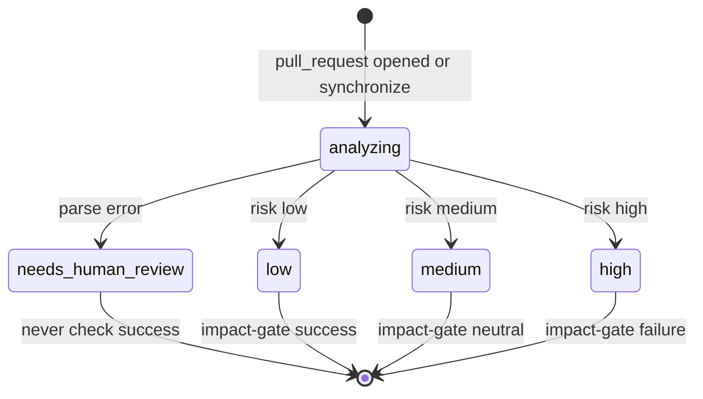

# Build spec — GitOps Impact Gate

> Give this file to the Cursor agent as the project brief. Keep it at the repo root as `AGENTS.md` or `.cursor/rules/project.md` so it is loaded into every session.

---

## 0. What we are building

A tool that reviews infrastructure-as-code pull requests by understanding the **relationships between resources**, not by checking files in isolation.

When a developer opens a PR touching Kubernetes manifests, the tool:

1. Builds a dependency graph of every resource in the repository
2. Rebuilds the graph as it would look after the change
3. Diffs the two graphs and walks outward from the changed nodes to find what breaks downstream
4. Runs existing deterministic scanners for known rule violations
5. Sends only the resulting findings to an LLM for explanation, severity ranking, and a fix patch
6. Posts a verdict on the PR and sets a status check that gates merge
7. After deploy, watches the affected workloads and rolls back automatically if they degrade

The novelty is step 1–3. Every existing linter checks a file against a ruleset. None of them can tell you that renaming a label leaves a Service matching zero pods, because that requires knowing what else exists in the repo.

**Worked example the tool must catch (this is the acceptance test for the whole project):**

A PR changes `spec.template.metadata.labels.app` on a Deployment from `checkout` to `checkout-v2`. The YAML is valid. Checkov, Trivy, and kube-linter all pass. But `Service/checkout` has `spec.selector.app: checkout`, so it now matches no pods, and `Ingress/public` routes traffic to that Service. The tool must report: broken selector, the exact path Ingress → Service → (no pods), severity high because the Ingress is externally exposed.

---

## 1. Non-negotiable constraints

Read these before writing any code. Do not violate them without asking.

1. **Python 3.12 only.** One language across the whole project, including the Kubernetes controller.
2. **One service, modular internally.** No microservices, no message queues, no separate repos. Package boundaries are enforced by imports, not by network calls.
3. **Deterministic first, LLM last.** Anything that can be computed must be computed. The LLM never discovers findings — it only explains, ranks, and patches findings that the graph or the scanners produced. If you catch yourself writing a prompt that asks the model to "find problems in this YAML", stop: that is the wrong architecture.
4. **The LLM never emits commands that get executed.** No generated `kubectl`, no generated shell. Remediation actions come from a fixed enum. The model may only select from that enum and explain the choice.
5. **No cloud resources.** Everything runs locally against a `kind` cluster. No AWS, no GCP, no paid infrastructure.
6. **Every LLM call must be cacheable and mockable.** Tests never hit a real provider.
7. **Fail closed on parse errors.** If the graph builder cannot understand a file, the verdict is "needs human review", never "safe".

---

## 2. Repository layout

Create exactly this structure. Do not add top-level directories without asking.

```
gitops-impact-gate/
├── src/impactgate/
│   ├── __init__.py
│   ├── models.py              # shared dataclasses / pydantic models
│   ├── config.py              # settings loaded from env + repo config file
│   │
│   ├── graph/
│   │   ├── __init__.py
│   │   ├── parser.py          # YAML -> Resource objects
│   │   ├── builder.py         # Resource objects -> networkx DiGraph
│   │   ├── edges.py           # one function per edge extraction rule
│   │   └── diff.py            # before/after graph comparison
│   │
│   ├── analysis/
│   │   ├── __init__.py
│   │   ├── impact.py          # blast radius traversal
│   │   ├── rules.py           # graph-level integrity checks
│   │   └── severity.py        # deterministic severity floor
│   │
│   ├── scanners/
│   │   ├── __init__.py
│   │   ├── base.py            # Scanner protocol
│   │   ├── checkov.py
│   │   ├── trivy.py
│   │   └── kubelinter.py
│   │
│   ├── llm/
│   │   ├── __init__.py
│   │   ├── provider.py        # Provider protocol + factory
│   │   ├── gemini.py
│   │   ├── groq.py
│   │   ├── ollama.py
│   │   ├── prompts.py         # prompt templates, versioned
│   │   └── schema.py          # expected JSON response schema
│   │
│   ├── cache/
│   │   ├── __init__.py
│   │   ├── fingerprint.py     # cache key computation
│   │   └── store.py           # on-disk cache
│   │
│   ├── report/
│   │   ├── __init__.py
│   │   ├── markdown.py        # PR comment rendering
│   │   └── mermaid.py         # impact subgraph -> mermaid source
│   │
│   ├── github/
│   │   ├── __init__.py
│   │   ├── webhook.py         # FastAPI routes
│   │   └── client.py          # PyGithub wrapper
│   │
│   ├── controller/
│   │   ├── __init__.py
│   │   ├── watcher.py         # kopf handlers
│   │   ├── actions.py         # bounded remediation enum + executors
│   │   └── policy.py          # RemediationPolicy CRD handling
│   │
│   └── cli.py                 # typer CLI for local runs without GitHub
│
├── tests/
│   ├── fixtures/              # small manifest sets, one dir per scenario
│   └── ...
├── demo/
│   ├── manifests/             # the three demo scenarios
│   └── kind-config.yaml
├── deploy/
│   └── crd.yaml               # RemediationPolicy definition
├── pyproject.toml
└── AGENTS.md                  # this file
```

---

## 3. Core data models

Put these in `models.py`. Use pydantic v2. Everything downstream depends on these, so build them first and do not change them casually.

```python
class ResourceRef(BaseModel):
    api_version: str
    kind: str
    name: str
    namespace: str | None = None

    def key(self) -> str:
        return f"{self.namespace or '_cluster'}/{self.kind}/{self.name}"


class Resource(BaseModel):
    ref: ResourceRef
    spec: dict              # full parsed manifest
    source_file: str        # repo-relative path
    source_line: int        # line where this document starts


class Edge(BaseModel):
    source: str             # ResourceRef.key()
    target: str
    kind: EdgeKind          # enum, see section 4
    detail: str             # e.g. "selector app=checkout"


class Finding(BaseModel):
    id: str                 # stable hash, see section 8
    origin: Literal["graph", "scanner"]
    rule: str               # e.g. "broken-selector" or "CKV_K8S_20"
    resource: ResourceRef
    path: list[str]         # chain of resource keys, for graph findings
    evidence: str           # the exact lines/values that triggered it
    severity_floor: Severity  # deterministic minimum, LLM may raise not lower


class Verdict(BaseModel):
    finding_id: str
    severity: Severity
    explanation: str        # plain English, from LLM
    suggested_fix: str | None
    confidence: float


class GateDecision(BaseModel):
    risk: Literal["low", "medium", "high"]
    verdicts: list[Verdict]
    reason: str
```

---

## 4. The graph — this is the heart of the project

### Node types

One node per Kubernetes resource, keyed by `ResourceRef.key()`. Also create **virtual nodes** for label sets, because label matching is many-to-many and modelling it as a direct edge loses information.

### Edge extraction rules

Implement each as a separate function in `edges.py` with the signature `def extract(resources: list[Resource]) -> list[Edge]`. Write a unit test for each one before moving to the next.

| Edge kind | From | To | How to find it |
|---|---|---|---|
| `SELECTS` | Service | Deployment/StatefulSet/DaemonSet | `Service.spec.selector` is a subset of the workload's `spec.template.metadata.labels` |
| `ROUTES_TO` | Ingress | Service | `spec.rules[].http.paths[].backend.service.name` |
| `MOUNTS_CONFIG` | Workload | ConfigMap | `spec.template.spec.volumes[].configMap.name` |
| `MOUNTS_SECRET` | Workload | Secret | `spec.template.spec.volumes[].secret.secretName` |
| `ENV_FROM` | Workload | ConfigMap/Secret | `containers[].envFrom[]` and `containers[].env[].valueFrom.*Ref.name` |
| `CLAIMS` | Workload | PersistentVolumeClaim | `volumes[].persistentVolumeClaim.claimName` |
| `RUNS_AS` | Workload | ServiceAccount | `spec.template.spec.serviceAccountName` |
| `GRANTS` | RoleBinding/ClusterRoleBinding | ServiceAccount, Role/ClusterRole | `subjects[]` and `roleRef` |
| `SCALES` | HPA | Workload | `spec.scaleTargetRef` |
| `TARGETS` | NetworkPolicy | Workload | `spec.podSelector` matches workload pod labels |
| `IMAGE` | Workload | image string (virtual node) | `containers[].image` |

**Namespace rules:** a reference without an explicit namespace resolves within the same namespace as the referring resource. Cross-namespace references are only legal for a few kinds — treat an unresolvable reference as a finding, not as a silent miss.

**Unresolved targets matter more than resolved ones.** When an edge points at something that does not exist, keep the edge with a `MISSING` marker on the target. That dangling edge is exactly what a broken-selector finding is made of. Do not drop it.

### Graph-level integrity checks (`analysis/rules.py`)

These are the findings the graph produces. Each returns zero or more `Finding` objects.

1. `broken_selector` — a Service whose selector matches no workload
2. `dangling_reference` — any edge whose target does not exist (ConfigMap, Secret, PVC, ServiceAccount, Role)
3. `orphaned_ingress` — an Ingress routing to a Service that does not exist
4. `unreachable_workload` — a workload with no Service selecting it, where one existed before the change
5. `policy_contradiction` — a NetworkPolicy that denies traffic an Ingress or another workload requires
6. `image_regression` — an image tag moving to `latest`, or to a tag that does not follow the repo's existing pattern
7. `scale_target_missing` — an HPA pointing at a workload that does not exist

Checks 1–4 are required for the first milestone. 5–7 can come later.

---

## 5. Impact analysis (`analysis/impact.py`)

```python
def compute_impact(
    before: nx.DiGraph,
    after: nx.DiGraph,
    changed_files: list[str],
) -> ImpactResult
```

Algorithm:

1. Identify changed nodes: any resource whose parsed spec differs between the two graphs, plus any resource defined in a changed file.
2. Run all integrity checks against `after`. Discard any finding that also exists in `before` — we only report what this PR introduced. Pre-existing problems are noise and will get the tool disabled.
3. For each new finding, compute the **reverse reachability set**: walk incoming edges from the broken node to find everything that depends on it, up to a depth limit of 5.
4. Mark any path that terminates at an Ingress, LoadBalancer Service, or NodePort as **externally exposed** — this raises severity.
5. Return findings with their paths.

`severity_floor` is deterministic and set here, before any LLM involvement:

- `critical` — externally exposed path broken
- `high` — a workload becomes unreachable, or a Secret/ConfigMap reference dangles
- `medium` — internal-only reference broken
- `low` — everything else

The LLM may raise severity. **It may never lower it.** Enforce this in code, not in the prompt.

---

## 6. Scanners (`scanners/`)

Run each scanner as a subprocess against the changed files only. Parse JSON output into `Finding` objects with `origin="scanner"`.

- Checkov: `checkov -f <file> -o json --compact`
- Trivy: `trivy config <file> --format json`
- kube-linter: `kube-linter lint <file> --format json`

Requirements:

- Run them concurrently (`asyncio.gather` over `asyncio.create_subprocess_exec`)
- If a scanner binary is missing, log a warning and continue — never crash the run
- Deduplicate: if two scanners report the same rule on the same resource, keep one
- Hard timeout of 30 seconds per scanner

---

## 7. LLM layer (`llm/`)

### Provider abstraction

```python
class Provider(Protocol):
    async def complete(self, prompt: str, *, max_tokens: int = 1500) -> str: ...
```

Three implementations: `GeminiProvider` (default), `GroqProvider`, `OllamaProvider`. Selected by `IMPACTGATE_LLM_PROVIDER` env var. Every implementation must:

- Retry on 429 with exponential backoff, respecting `Retry-After` and rate limit headers where present
- Fall back to the next configured provider after 3 failures
- Never raise into the caller — return a degraded `Verdict` with `confidence=0.0` and an explanation saying analysis was unavailable

### Prompt contract

One prompt, versioned as a constant `PROMPT_VERSION = "v1"`. The prompt receives:

- The finding: rule, resource, evidence, path, severity floor
- The relevant diff hunk only — never the whole file
- The environment (namespace name and whether the path is externally exposed)

It must return **only** JSON matching `llm/schema.py`:

```json
{
  "severity": "critical|high|medium|low",
  "explanation": "2-3 sentences, plain English, no jargon",
  "suggested_fix": "unified diff or null",
  "confidence": 0.0
}
```

Rules for the prompt itself:

- Instruct the model that findings are already verified — its job is explanation and ranking, not detection
- Instruct it to return null for `suggested_fix` when it is not confident, rather than guessing
- Strip markdown code fences before parsing; retry once with a stricter instruction on parse failure; on second failure return a degraded verdict

### Batching

One call per finding is too many. Group findings by rule type and send at most 10 per call, asking for an array of verdicts. This matters because free-tier providers cap tokens per minute, not just requests.

---

## 8. Incremental evaluation and caching (`cache/`)

Model this on Gradle's configuration cache: fingerprint the inputs, reuse the result when the fingerprint is unchanged, invalidate downstream when it changes.

### Fingerprints

```python
def node_fingerprint(graph: nx.DiGraph, node: str) -> str
```

The fingerprint of a node is a SHA-256 over:

1. The canonical serialization of that resource's spec (sorted keys)
2. The fingerprints of every node it depends on, transitively, in sorted order
3. `PROMPT_VERSION`
4. The tool version
5. The set of scanner versions

Points 3–5 mean a prompt change or a tool upgrade invalidates everything. That is intentional: a cached verdict produced by a different question is not a valid answer.

### What gets cached

| Tier | Key | Value |
|---|---|---|
| Parsed manifests | file content hash | `list[Resource]` |
| Scanner results | file content hash + scanner version | `list[Finding]` |
| LLM verdicts | `Finding.id` (which includes the node fingerprint) | `Verdict` |

`Finding.id` = SHA-256 of `(rule, resource.key(), evidence, node_fingerprint)`.

### Correctness rule

**A cache miss is cheap. A stale hit is a production incident.** When in doubt about whether something is an input to a fingerprint, include it. Never cache a "no findings" result for a subgraph whose fingerprint computation raised an exception — treat that as uncacheable.

Store as JSON files under `.impactgate-cache/`, keyed by hash. Add a `--no-cache` CLI flag and an env var to disable it entirely for debugging.

Report cache statistics in every run: nodes evaluated, nodes reused, LLM calls made, LLM calls saved. These numbers go on a slide.

---

## 9. GitHub integration (`github/`)

FastAPI app with one route: `POST /webhook`.

- Verify the `X-Hub-Signature-256` HMAC against the webhook secret. Reject unsigned requests with 401. Do this before parsing the body.
- Handle `pull_request` events with action `opened` or `synchronize`. Ignore everything else with a 200.
- Return 200 immediately and process in a background task — GitHub times out at 10 seconds.
- Clone or fetch the repo at both the base SHA and the head SHA. Use a shallow fetch. Cache clones under `/tmp` keyed by repo.

Output on the PR:

1. A single comment, updated in place on subsequent pushes (find the previous comment by a hidden HTML marker, do not spam new comments)
2. The comment contains: risk verdict, a Mermaid diagram of the impact subgraph, findings ordered by severity with the dependency path as evidence, and fix suggestions as `suggestion` blocks so they are one-click applicable
3. A commit status check named `impact-gate` — `success` for low, `neutral` for medium, `failure` for high

---

## 10. Kubernetes controller (`controller/`)

Built with `kopf`. Only starts if `IMPACTGATE_CONTROLLER_ENABLED=true`.

### Watches

- Pods entering `CrashLoopBackOff`, `ImagePullBackOff`, `CreateContainerConfigError`
- Pods whose `lastState.terminated.reason == OOMKilled`
- Events with reason `FailedScheduling`, `Unhealthy`, `BackOff`

### Debounce

Do not react to the first failure. Require N restarts within M minutes (defaults: 3 restarts in 5 minutes, both configurable). Normal rollouts produce transient failures and reacting to them will cause chaos.

### Diagnosis

Fetch `logs --previous`, pod events, the owning workload, and its ReplicaSet history. Pass through the same log compression and classification pipeline used for CI logs. Reuse that code — do not write a second implementation.

### Actions — a closed enum, no exceptions

```python
class Action(StrEnum):
    ROLLBACK = "rollback"          # to last-known-healthy ReplicaSet
    BUMP_MEMORY = "bump_memory"    # multiply limit by factor, capped
    RESTART = "restart"            # rollout restart
    SCALE_OUT = "scale_out"        # +1 replica, capped
    ESCALATE = "escalate"          # do nothing, notify a human
```

The classifier selects one. There is no path by which the model produces a command.

### Guardrails — implement all of these

1. **Dry-run by default.** `mode: enforce` must be set explicitly per namespace in the CRD.
2. **Label gate.** Only act on resources labelled `impactgate.io/managed: "true"`.
3. **Confidence floor.** Below `minConfidence` (default 0.8), force `ESCALATE`.
4. **Circuit breaker.** Max N actions per workload per hour (default 2). On breach, stop acting on that workload and escalate.
5. **Healthy-revision tracking.** Record a ReplicaSet as healthy only after it has had all replicas ready for ≥10 minutes. `ROLLBACK` may only target such a revision. If none exists, escalate.
6. **Audit everything.** Every decision emits a Kubernetes Event on the workload and writes a record containing the evidence, the classification, the action, and the outcome.

### CRD

```yaml
apiVersion: impactgate.io/v1
kind: RemediationPolicy
metadata:
  name: default
  namespace: demo
spec:
  mode: dry-run
  minConfidence: 0.8
  allowedActions: [rollback, restart]
  maxActionsPerHour: 2
  memoryBumpFactor: 1.5
  memoryLimitCeiling: "2Gi"
```

Ship the CRD in `deploy/crd.yaml`. If no policy exists for a namespace, the effective policy is dry-run with no allowed actions.

---

## 11. Metrics

Expose `/metrics` in Prometheus format:

- `impactgate_findings_total{rule,severity,origin}`
- `impactgate_gate_decisions_total{risk}`
- `impactgate_llm_calls_total{provider,cached}`
- `impactgate_analysis_duration_seconds` (histogram)
- `impactgate_remediation_total{action,outcome}`
- `impactgate_time_to_recovery_seconds` (histogram — failure detected to all replicas ready)

The last one is the MTTR number for the presentation. Make sure the timer starts at detection, not at action.

---

## 12. Testing

Non-negotiable minimums:

- Every edge extraction rule has a unit test with a minimal manifest pair
- Every integrity check has a positive and a negative test
- The broken-selector scenario from section 0 is an end-to-end test that must pass
- Fingerprint tests: changing a ConfigMap must change the fingerprint of every workload that mounts it
- LLM provider tests use a fake provider — no network calls in the test suite
- Controller tests use kopf's testing utilities, not a live cluster

Run `pytest`, `ruff check`, and `mypy` before declaring any milestone complete.

---

## 13. Demo fixtures (`demo/manifests/`)

Three scenarios, each a self-contained directory plus a "broken" patch:

1. **`selector-break/`** — the section 0 scenario. The headline demo. Must show Checkov passing and the tool failing.
2. **`bad-image/`** — a Deployment whose image tag is changed to one that does not exist. Result: CrashLoopBackOff, controller rolls back.
3. **`real-bug/`** — an app that starts fine and then crashes from a genuine code bug. The tool must classify it as a real failure and **escalate rather than remediate**. This scenario is the most important one for the presentation: it proves the system knows when not to act.

---

## 14. Build order

Do not skip ahead. Each milestone must be tested and committed before the next starts.

| # | Milestone | Done when |
|---|---|---|
| M0 | Skeleton, models, config, CLI stub | `impactgate analyze <dir>` runs and prints an empty report |
| M1 | Parser + graph builder + all edge rules | Graph of the demo manifests has the expected nodes and edges |
| M2 | Graph diff + integrity checks 1–4 + impact traversal | Selector-break scenario produces the correct finding and path |
| M3 | Scanner integration | Checkov/Trivy findings merge into the same report |
| M4 | LLM layer with Gemini + fake provider | Findings get explanations and severities; tests pass without network |
| M5 | Markdown + Mermaid report, GitHub webhook, status check | Real PR on a test repo gets a comment and a status |
| **— pre-final demo cutoff —** | | |
| M6 | Fingerprinting and cache | Second run on unchanged repo makes zero LLM calls |
| M7 | Controller: watch, debounce, diagnose, dry-run | Dry-run logs the action it would have taken |
| M8 | Actions, policy CRD, guardrails, audit | All three demo scenarios behave correctly |
| M9 | Prometheus metrics + Grafana dashboard | MTTR comparison chart renders |

Milestones M0 through M5 are the pre-final submission. Everything after is for the final round.

---

## 15. How to work

- **Confirm before acting on anything structural.** Adding a dependency, changing a model in `models.py`, renaming a module, or altering the repo layout — propose it and wait. Small edits inside a module you were asked to build do not need confirmation.
- **One milestone per branch.** Small commits with conventional messages (`feat:`, `fix:`, `test:`).
- **Write the test first** for anything in `graph/` or `analysis/`. These are the parts where a subtle bug produces a confidently wrong answer.
- **Do not add features that are not in this document.** No web UI beyond the metrics endpoint, no database, no auth system, no Slack integration, no Terraform support until M9 is done and there is time left.
- **When a spec here is ambiguous, ask rather than guess.** An implementation that is wrong in an interesting way costs more than a question.
- **Never mock away a hard problem.** If healthy-revision tracking is difficult, say so — do not stub it with a placeholder that always returns the previous ReplicaSet.

---

## 16. Explicitly out of scope

Do not build these, even if they seem useful:

- Terraform support (M9 at the earliest, and only if everything else is complete)
- Helm chart templating or Kustomize overlay rendering
- Multi-repo or multi-cluster support
- A user-facing web dashboard (the metrics endpoint is not a UI)
- Any form of authentication beyond the GitHub webhook signature
- Automatic merging of PRs — the tool sets a status, humans merge
- Storing anything in a database
- Message queues or microservices (one process; modules talk by import)
- AWS, GCP, or other paid cloud — local `kind` only
- Slack or other chat integrations
- LLM-discovered findings, or generated `kubectl` / shell
- A new PR comment per push (one comment, updated in place)
- Treating Checkov / Trivy / kube-linter as sufficient without the graph
- Marketplace, orgs, billing, or currency
- i18n / RTL
- `/health`
- Acting on workloads without `impactgate.io/managed: "true"`
- `mode: enforce` as a global default

---

## 17. Locked decisions

| Locked decision | Value |
|---|---|
| Product name | GitOps Impact Gate |
| Code package / import root | `impactgate` |
| GitHub commit status name | `impact-gate` |
| Language | Python 3.12 only (CLI, webhook, controller) |
| Process shape | One service; modules talk by import, not network |
| Auth | HMAC `X-Hub-Signature-256` vs webhook secret. Unsigned → 401. No user accounts |
| Tenancy | One deployment; one GitHub repo per webhook event. Not a marketplace |
| Primary channel | GitHub PR comment (updated in place) + status `impact-gate` |
| Default language | English (LLM prompt and PR comment). No i18n layer |
| LLM default | `GeminiProvider`, selected by `IMPACTGATE_LLM_PROVIDER` |
| Runtime cluster | local `kind` only |
| Parse errors | Fail closed: verdict is needs human review, never safe |
| LLM role | Explain / rank / patch findings already produced. Never discover findings. Never emit executable commands |
| Cache disable | `--no-cache` CLI flag and `IMPACTGATE_NO_CACHE` |
| Metrics bind | `IMPACTGATE_METRICS_PORT` / `--metrics-port` (default 8000; port 0 is ephemeral) |

---

## 18. Canonical vocabulary

Enums and rule names stay English `snake_case` in code. There is no translated UI. GitHub check name `impact-gate` and CRD YAML keys (`minConfidence`, `dry-run`) are wire format, not separate entities. Graph integrity **rule** strings on `Finding.rule` use kebab-case (`broken-selector`) as implemented.

| Term | Definition |
|---|---|
| GitOps Impact Gate | Product name. One product. |
| `impactgate` | Python package. Same product. |
| `impact-gate` | GitHub commit status context only. Do not use as the product name or package name. |
| Resource | Parsed Kubernetes object (`ref`, full manifest in `spec`, `source_file`, `source_line`) |
| ResourceRef | Identity: `api_version`, `kind`, `name`, `namespace`. `key()` = `{namespace or '_cluster'}/{kind}/{name}` |
| manifest | YAML document on disk. Do not use as a model name. |
| Workload | Role: Deployment, StatefulSet, or DaemonSet. Not a Kubernetes `kind`. |
| Edge | Directed relation `source` → `target` with `EdgeKind` and `detail` |
| EdgeKind | `SELECTS`, `ROUTES_TO`, `MOUNTS_CONFIG`, `MOUNTS_SECRET`, `ENV_FROM`, `CLAIMS`, `RUNS_AS`, `GRANTS`, `SCALES`, `TARGETS`, `IMAGE` |
| virtual node | Graph node that is not a Resource: a label set, or a container image string |
| MISSING | Marker on an Edge target that does not exist. Keep the edge. Do not drop it. |
| Finding | One verified problem. `origin` is `graph` or `scanner`. Main work entity for CI. |
| rule | Graph: `broken-selector`, `dangling-reference`, `orphaned-ingress`, `unreachable-workload` (and later `policy-contradiction`, `image-regression`, `scale-target-missing`). Scanners keep upstream IDs (`CKV_K8S_20`). |
| origin | `graph` or `scanner`. Not two finding types. |
| severity / `severity_floor` | `critical` \| `high` \| `medium` \| `low` on Finding and Verdict. Floor is deterministic. LLM may raise, never lower. |
| Verdict | LLM output for one Finding: `severity`, `explanation`, `suggested_fix`, `confidence` |
| GateDecision | PR-level outcome: `risk` (`low` \| `medium` \| `high`), `verdicts`, `reason`. Not a Finding. |
| risk | GateDecision only (`low` \| `medium` \| `high`). Do not call this severity. Maps to status `success` / `neutral` / `failure`. |
| needs human review | Parse-failure outcome. Not a `risk` value. Never treat as safe. |
| Provider | LLM backend protocol (`complete`). Implementations: `GeminiProvider`, `GroqProvider`, `OllamaProvider`. |
| Scanner | Subprocess Checkov / Trivy / kube-linter. Missing binary: warn and continue. |
| Action | Closed remediation enum: `rollback`, `bump_memory`, `restart`, `scale_out`, `escalate`. Python members `ROLLBACK` etc. are the same enum, not a second set. CRD `allowedActions` uses the values. |
| RemediationPolicy | CRD `impactgate.io/v1`. Namespace policy for the controller. |
| mode | Policy field: `dry-run` or `enforce`. Default if no policy: `dry-run` with no allowed actions. |

Do not use: issue, violation, alert, report (as type names); command (as something the LLM emits); marketplace/org/user (no such models).

---

## 19. Core flow

Distinctive pipeline: full-repo graph at both SHAs, then blast radius. Scanners and LLM are downstream of that. The README shows a simplified 8-node view; this is the webhook pipeline.



### Classifier / bind rules

| Stage | Inputs | Outputs | Bind vs fork |
|---|---|---|---|
| Edge extract | `list[Resource]` | `list[Edge]` | Bind in place. Unresolved target → `MISSING`, do not fork a second graph |
| Integrity checks | after graph (+ before for `unreachable_workload`) | Findings `origin=graph` | Bind to the Service / Ingress / workload that broke |
| Scanners | changed files | Findings `origin=scanner` | Bind to the Resource in that file. Missing binary: skip, do not fail the run |
| LLM | Finding + diff hunk + namespace + exposed flag | Verdict JSON | Bind to `finding_id`. Forbidden: new Findings. `suggested_fix` null if not confident |
| Controller classifier | pod logs/events, workload, ReplicaSet history | one `Action` | Bind to that workload. Forbidden: generated shell/`kubectl`. Guardrails may replace choice with `escalate` |

Namespace: a reference without namespace resolves in the referring Resource’s namespace. Unresolvable cross-namespace reference is a Finding, not a silent miss.

---

## 20. GateDecision state machine

Main CI entity is `GateDecision` (aggregation of Findings → Verdicts). Findings have no status field; they exist or they are dropped as pre-existing.



Controller `Action` is a separate machine: `rollback` | `bump_memory` | `restart` | `scale_out` | `escalate`.

| Status (code) | Meaning |
|---|---|
| `analyzing` | Background task running; HTTP already returned 200 |
| `needs_human_review` | Graph builder could not understand a file. Fail closed |
| `low` | `GateDecision.risk`; status `success` |
| `medium` | `GateDecision.risk`; status `neutral` |
| `high` | `GateDecision.risk`; status `failure` |
| `critical` / `high` / `medium` / `low` | Finding/Verdict **severity**, not GateDecision risk |

### Transition rules

1. Source of truth is `GateDecision` computed from Findings. The PR comment is a render. Redirects and UI do not exist and must not become SoT.
2. Ignore webhook events other than `pull_request` `opened` / `synchronize` (HTTP 200, no analysis).
3. Integrity checks run on the **after** graph. Drop any Finding that already existed on **before**.
4. LLM may raise `Verdict.severity` above `severity_floor`. Code must reject a lower value. Prompt is not the enforcement.
5. Parse failure → `needs_human_review`. Forbidden: mapping that to risk `low` or status `success`.
6. Status check mapping is fixed: `low`→`success`, `medium`→`neutral`, `high`→`failure`. Forbidden: inventing `critical` as a `risk` value.
7. Dangling edges stay in the graph with `MISSING`. Forbidden: omitting them because the target Resource is absent.
8. One PR comment, found by a hidden HTML marker, updated in place. Forbidden: a new comment per push.
9. Controller: no `RemediationPolicy` → `dry-run` and empty `allowedActions`. `enforce` must be explicit. Unlabelled workloads (`impactgate.io/managed` ≠ `"true"`) are not acted on. Confidence below `minConfidence` (default 0.8) → `escalate`. Circuit breaker default: 2 actions per workload per hour. `rollback` only onto a ReplicaSet that was fully ready for ≥10 minutes; else `escalate`.
