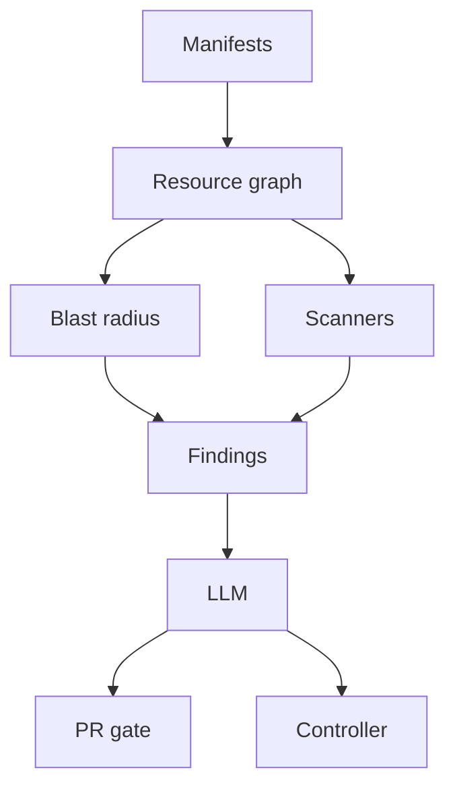

# GitOps Impact Gate

Relationship-aware review of Kubernetes infrastructure-as-code pull requests, plus a closed-enum controller that remediates (or refuses to remediate) failed workloads on a local `kind` cluster.

File-by-file linters cannot see that renaming a pod label leaves a Service matching zero pods. This tool builds a dependency graph of the repo, diffs before vs after, and walks the blast radius. Scanners and the LLM run **after** that: they never discover findings on their own.

## The problem

A PR changes `spec.template.metadata.labels.app` on a Deployment from `checkout` to `checkout-v2`. The YAML is valid. Checkov, Trivy, and kube-linter all pass. `Service/checkout` still has `spec.selector.app: checkout`, so it matches no pods, and `Ingress/public` still routes to that Service.

Impact Gate reports `broken-selector`, the path **Ingress → Service → (no pods)**, and severity **critical** because the Ingress is externally exposed. That scenario lives in `demo/manifests/selector-break/` and is the acceptance test for the project.

## Install

Python **3.12** only.

```bash
python3.12 -m venv .venv
source .venv/bin/activate
python -m pip install -U pip
pip install -e ".[dev]"
```

Optional scanners (missing binaries are skipped, not fatal). Install Checkov with **pipx**, never into this venv — Checkov pins an older `networkx` and breaks the graph layer:

```bash
pipx install checkov
# kube-linter and trivy: whatever your OS package or release binary is
```

```bash
pytest -q    # currently 175 passed
ruff check src tests
mypy
```

## Quickstart

```bash
export IMPACTGATE_LLM_PROVIDER=fake   # tests and local runs; no network
impactgate analyze demo/manifests/selector-break --no-cache
# clean tree: **Risk:** low, no findings
```

Reproduce the headline catch against a broken copy:

```bash
rm -rf /tmp/ig-before /tmp/ig-after
cp -a demo/manifests/selector-break /tmp/ig-before
cp -a demo/manifests/selector-break /tmp/ig-after
# change only the pod-template label app: checkout → checkout-v2
# (leave spec.selector.matchLabels as checkout)
IMPACTGATE_LLM_PROVIDER=fake impactgate analyze /tmp/ig-after --before /tmp/ig-before --no-cache
```

Expected:

```text
**Risk:** high
3 new finding(s): broken-selector, mismatching-selector, unreachable-workload
### critical: `broken-selector`
```

The finding path includes `demo/Ingress/public` → `demo/Service/checkout` → `(no pods)`.

LLM providers: `IMPACTGATE_LLM_PROVIDER` = `gemini` (default), `groq`, `ollama`, or `fake`. Cache lives under `.impactgate-cache/`; `--no-cache` or `IMPACTGATE_NO_CACHE` disables it.

## Demos

Three scenarios under `demo/manifests/`. The live kind walkthrough, expected logs, and crib sheet are in **[demo/RUNBOOK.md](demo/RUNBOOK.md)**.

| Scenario | What you change | What the tool does |
|---|---|---|
| **selector-break** | Deployment template label `checkout` → `checkout-v2`; Service selector unchanged | Graph finding `broken-selector`, path Ingress → Service → (no pods), risk **high** / severity **critical**. Checkov does not report this. |
| **bad-image** | `kubectl set image` to `nginx:does-not-exist` | After debounce: **rollback** to the last ReplicaSet that was fully Ready for ≥10 minutes. Image returns to `nginx:1.25`. Event `ImpactGateRemediation`. |
| **real-bug** | Container prints a traceback and exits 1 | After debounce: **escalate**. No rollback, no restart. Proves the system knows when not to act. |

Demos 2 and 3 need a `kind` cluster, the CRD + policy in **enforce**, and:

```bash
kubectl apply -f deploy/crd.yaml
kubectl create namespace demo
kubectl apply -f deploy/policy.yaml
kubectl apply -f deploy/rbac.yaml
kubectl -n demo patch remediationpolicy/default --type merge -p '{"spec":{"mode":"enforce"}}'

IMPACTGATE_CONTROLLER_ENABLED=true impactgate controller --namespace demo -v
```

The CLI watches `demo` by default and attaches `KubernetesClusterClient`. Fallback: `kopf run -m impactgate.controller.watcher --namespace demo --standalone --verbose`.

The label gate reads **pod** labels. Set `impactgate.io/managed: "true"` on `spec.template.metadata.labels` (already true in the demo manifests). A label on the Deployment object is ignored.

## Architecture

One Python package (`impactgate`). Modules talk by import, not by network.



The detailed webhook pipeline and `GateDecision` state machine are in **[AGENTS.md](AGENTS.md)** (§19–§20).

1. Parse manifests to `Resource` objects; fail closed if a file cannot be understood (needs human review, never “safe”).
2. Build a `DiGraph` at the before SHA and the after SHA. Edges include `SELECTS`, `ROUTES_TO`, mounts, env, RBAC, HPA, NetworkPolicy, images. Unresolved targets stay in the graph as `MISSING`.
3. Run graph integrity checks on **after**; drop findings that already existed on **before**.
4. Walk reverse reachability (depth 5). Paths that end at an Ingress, LoadBalancer, or NodePort are externally exposed and raise `severity_floor`.
5. Run scanners on **changed files only**. Deduplicate. Missing scanner binary: warn and continue.
6. Send findings to the LLM in batches (max 10 per rule). The model may raise severity, never lower it. Code enforces the floor.
7. GitHub: `POST /webhook` verifies `X-Hub-Signature-256`, accepts `pull_request` `opened` / `synchronize`, returns 200, analyzes in the background, updates one PR comment in place, sets commit status `impact-gate` (`success` / `neutral` / `failure`). Serve the FastAPI app from `impactgate.github.webhook:create_app` (`IMPACTGATE_WEBHOOK_SECRET` must match GitHub).
8. In-cluster: kopf watches managed pods. Classifier picks one `Action`. Executors mutate via the Kubernetes API. The LLM never emits `kubectl`.

Prometheus text at `/metrics` on the webhook app and on `impactgate controller` (`--metrics-port`, default 8000), including `impactgate_time_to_recovery_seconds` from **detection** to Ready.

## Guardrails

Controller, all enforced in code:

1. **Dry-run by default.** `mode: enforce` is explicit per namespace on `RemediationPolicy`. No policy → dry-run and no allowed actions.
2. **Label gate.** Only pods with `impactgate.io/managed: "true"`.
3. **Confidence floor.** Below `minConfidence` (default 0.8) → `escalate`.
4. **Circuit breaker.** Default 2 actions per workload per hour, then escalate.
5. **Healthy-revision tracking.** `rollback` only onto a ReplicaSet that was fully Ready for ≥10 minutes. Otherwise escalate.
6. **Debounce.** Default 3 failures in 5 minutes so a normal rollout is not treated as a crash.
7. **Closed `Action` enum:** `rollback`, `bump_memory`, `restart`, `scale_out`, `escalate`. No generated shell.
8. **Audit.** Every decision emits a Kubernetes Event and records evidence, classification, action, and outcome.

## Layout

```text
src/impactgate/     package (graph, analysis, scanners, llm, cache, report, github, controller)
tests/              pytest (fake LLM provider; no live cluster required)
demo/manifests/     selector-break, bad-image, real-bug
demo/RUNBOOK.md     live kind walkthrough
deploy/             CRD, policy, RBAC, Grafana dashboard
AGENTS.md           build spec (locked decisions, vocabulary, out of scope)
```

The build spec, including locked decisions and canonical vocabulary, is **[AGENTS.md](AGENTS.md)**.
