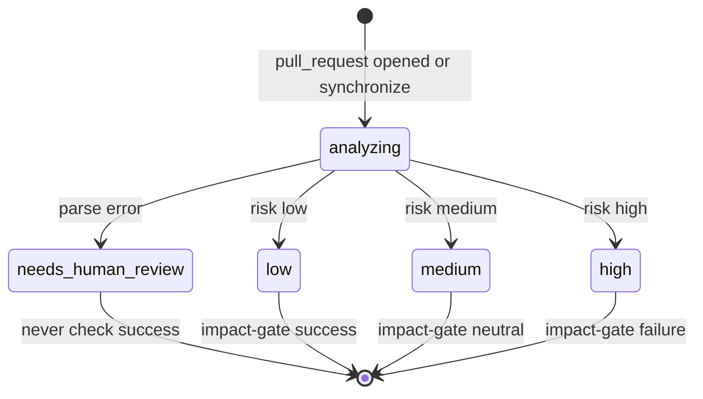
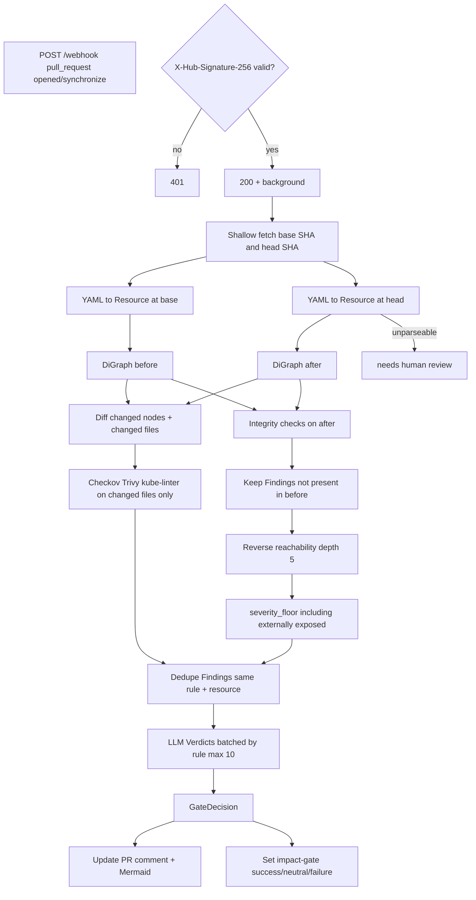

# GitOps Impact Gate

Relationship-aware review of Kubernetes infrastructure-as-code pull requests.

```bash
pip install -e ".[dev]"
impactgate analyze demo/manifests/selector-break
```
For engineers who change Kubernetes manifests in Git: compute what a pull request breaks in the resource graph, then gate merge and (later) remediate failed workloads.

This repo is a locked build spec (`AGENTS.md`). There is no `src/`, `pyproject.toml`, CLI, or tests in the tree. Do not treat the layout below as files that exist.

**TBD:** HTTP bind address, cache-disable env var name, `ImpactResult` fields, which Kubernetes kinds may legally reference across namespaces.

## Locked decisions

| Locked decision | Value |
|---|---|
| Product name | GitOps Impact Gate |
| Code package / import root | `impactgate` |
| GitHub commit status name | `impact-gate` |
| Language | Python 3.12 only (CLI, webhook, controller) |
| Process shape | One service; modules talk by import, not network |
| Auth | HMAC `X-Hub-Signature-256` vs webhook secret. Unsigned → 401. No user accounts |
| Tenancy | One deployment; one GitHub repo per webhook event. Not a marketplace |
| Primary channel | GitHub PR comment (updated in place) + status `impact-gate` |
| Default language | English (LLM prompt and PR comment). No i18n layer |
| LLM default | `GeminiProvider`, selected by `IMPACTGATE_LLM_PROVIDER` |
| Runtime cluster | local `kind` only |
| Parse errors | Fail closed: verdict is needs human review, never safe |
| LLM role | Explain / rank / patch findings already produced. Never discover findings. Never emit executable commands |

## Persona and jobs-to-be-done

**Primary operator:** the engineer who opens or reviews a Kubernetes manifest PR.

There is no second portal. GitHub comment, local CLI, and the in-cluster controller are the same product.

| Pain | Product job |
|---|---|
| YAML, Checkov, Trivy, and kube-linter all pass, but a label rename leaves `Service` matching zero pods | Build a repo-wide graph, diff before vs after, emit `broken_selector` with path Ingress → Service → (no pods) |
| File-scoped linters cannot see that an Ingress still routes to that Service | Walk reverse reachability from the broken node (depth 5); mark paths that end at Ingress / LoadBalancer / NodePort as externally exposed and raise `severity_floor` |
| Pre-existing junk in the repo would get the tool disabled | Report only findings introduced by this PR |
| An LLM asked to “find problems in YAML” invents issues | Graph + scanners produce `Finding`; LLM only writes `Verdict` |
| Post-deploy CrashLoopBackOff from a bad image | Controller (M7+) selects from `Action`; it does not generate `kubectl` |

Acceptance case the whole product is scored on: PR changes Deployment `spec.template.metadata.labels.app` from `checkout` to `checkout-v2`. `Service/checkout` selector stays `app: checkout`. `Ingress/public` still routes to that Service. Tool reports broken selector, path Ingress → Service → (no pods), severity at least high because the Ingress is externally exposed.

## Surfaces

No HTML UI. No screen graph. Four entry points, one of which (`impactgate analyze`) is the M0 definition of done.

### CLI

| Screen | Purpose |
|---|---|
| `impactgate analyze <dir>` | Local run without GitHub. M0: print an empty report |

### GitHub webhook (FastAPI)

| Screen | Purpose |
|---|---|
| `POST /webhook` | Verify HMAC, accept `pull_request` `opened` / `synchronize`, 200 immediately, analyze in background |
| PR comment | Single comment: risk, Mermaid impact subgraph, findings by severity, `suggestion` blocks |
| Commit status `impact-gate` | `success` = risk `low`; `neutral` = `medium`; `failure` = `high` |

### Kubernetes controller (`kopf`)

Starts only if `IMPACTGATE_CONTROLLER_ENABLED=true`. Not in pre-final (M0–M5).

| Screen | Purpose |
|---|---|
| Pod / Event watches | CrashLoopBackOff, ImagePullBackOff, CreateContainerConfigError, OOMKilled, FailedScheduling, Unhealthy, BackOff |
| `RemediationPolicy` CRD | Per-namespace mode and allowed `Action` values |

### Metrics

| Screen | Purpose |
|---|---|
| `/metrics` | Prometheus text (M9) |

### URL namespaces

| Path | Audience |
|---|---|
| `POST /webhook` | GitHub |
| `/metrics` | Operator scrape |

All other paths are unspecified. There is no `/health`.

## Canonical vocabulary

Enums and rule names stay English `snake_case` in code. There is no translated UI. GitHub check name `impact-gate` and CRD YAML keys (`minConfidence`, `dry-run`) are wire format, not separate entities.

| Term | Definition |
|---|---|
| GitOps Impact Gate | Product name. One product. |
| `impactgate` | Python package. Same product. |
| `impact-gate` | GitHub commit status context only. Do not use as the product name or package name. |
| Resource | Parsed Kubernetes object (`ref`, full manifest in `spec`, `source_file`, `source_line`) |
| ResourceRef | Identity: `api_version`, `kind`, `name`, `namespace`. `key()` = `{namespace or '_cluster'}/{kind}/{name}` |
| manifest | YAML document on disk. Do not use as a model name. |
| Workload | Role: Deployment, StatefulSet, or DaemonSet. Not a Kubernetes `kind`. |
| Edge | Directed relation `source` → `target` with `EdgeKind` and `detail` |
| EdgeKind | `SELECTS`, `ROUTES_TO`, `MOUNTS_CONFIG`, `MOUNTS_SECRET`, `ENV_FROM`, `CLAIMS`, `RUNS_AS`, `GRANTS`, `SCALES`, `TARGETS`, `IMAGE` |
| virtual node | Graph node that is not a Resource: a label set, or a container image string |
| MISSING | Marker on an Edge target that does not exist. Keep the edge. Do not drop it. |
| Finding | One verified problem. `origin` is `graph` or `scanner`. Main work entity for CI. |
| rule | Graph: `broken_selector`, `dangling_reference`, `orphaned_ingress`, `unreachable_workload` (M0–M5); later `policy_contradiction`, `image_regression`, `scale_target_missing`. Scanners keep upstream IDs (`CKV_K8S_20`). Do not use kebab-case for graph rules (`broken-selector` is not a second rule). |
| origin | `graph` or `scanner`. Not two finding types. |
| severity / `severity_floor` | `critical` \| `high` \| `medium` \| `low` on Finding and Verdict. Floor is deterministic. LLM may raise, never lower. |
| Verdict | LLM output for one Finding: `severity`, `explanation`, `suggested_fix`, `confidence` |
| GateDecision | PR-level outcome: `risk` (`low` \| `medium` \| `high`), `verdicts`, `reason`. Not a Finding. |
| risk | GateDecision only (`low` \| `medium` \| `high`). Do not call this severity. Maps to status `success` / `neutral` / `failure`. |
| needs human review | Parse-failure outcome. Not a `risk` value. Never treat as safe. |
| Provider | LLM backend protocol (`complete`). Implementations: `GeminiProvider`, `GroqProvider`, `OllamaProvider`. |
| Scanner | Subprocess Checkov / Trivy / kube-linter. Missing binary: warn and continue. |
| Action | Closed remediation enum: `rollback`, `bump_memory`, `restart`, `scale_out`, `escalate`. Python members `ROLLBACK` etc. are the same enum, not a second set. CRD `allowedActions` uses the values. |
| RemediationPolicy | CRD `impactgate.io/v1`. Namespace policy for the controller. |
| mode | Policy field: `dry-run` or `enforce`. Default if no policy: `dry-run` with no allowed actions. |

Do not use: issue, violation, alert, report (as type names); command (as something the LLM emits); marketplace/org/user (no such models).

## Domain model

Specified for `src/impactgate/models.py` (pydantic v2). That file is not in the tree. Do not change these casually once implemented.

| Owner (specified module) | Models |
|---|---|
| `models.py` | `ResourceRef`, `Resource`, `Edge`, `Finding`, `Verdict`, `GateDecision` |
| `graph/` | `Resource` list → networkx `DiGraph`; `Edge` extraction |
| `analysis/` | Findings from integrity checks; `severity_floor`; impact paths |
| `scanners/` | Findings with `origin="scanner"` |
| `llm/` | Verdicts from Findings; `PROMPT_VERSION = "v1"` |
| `controller/` | `Action`, `RemediationPolicy` handling |
| `cache/` | fingerprints and on-disk JSON under `.impactgate-cache/` |

No database. No User, Org, Message, or Money models.

### Relations (in-memory, not SQL)

```
GateDecision 1—* Verdict
Verdict.finding_id → Finding.id
Finding.resource → ResourceRef
Resource.ref → ResourceRef          (1:1)
Edge.source → ResourceRef.key()
Edge.target → ResourceRef.key() | virtual node | MISSING
DiGraph node: ResourceRef.key() | virtual(label-set) | virtual(image)

RemediationPolicy (CRD, per namespace) — not joined to Finding
Action — chosen for a workload; not a row related by FK
namespace on ResourceRef is nullable (cluster-scoped → key prefix `_cluster`)
Verdict.suggested_fix is nullable
```

### Minimum fields on Finding

`id`, `origin`, `rule`, `resource`, `path`, `evidence`, `severity_floor`

`id` = SHA-256 of `(rule, resource.key(), evidence, node_fingerprint)`.

### Snapshot / invalidation

- Analyze **before** graph at base SHA and **after** graph at head SHA. Findings present in both are discarded.
- Cached `Verdict` is keyed by `Finding.id`, which includes `node_fingerprint`. Fingerprint is SHA-256 of: canonical Resource spec, transitive dependency fingerprints (sorted), `PROMPT_VERSION`, tool version, scanner versions. A ConfigMap change must change every mounting workload’s fingerprint.
- Never reuse a cached “no findings” result if fingerprint computation raised. Cache miss is cheap; stale hit is an incident.
- `--no-cache` CLI flag and an env var disable cache (env name TBD).

## State machine

Main CI entity is `GateDecision` (aggregation of Findings → Verdicts). Findings have no status field; they exist or they are dropped as pre-existing.



Controller `Action` (M7+, not this state machine): `rollback` | `bump_memory` | `restart` | `scale_out` | `escalate`.

| Status (code) | Meaning |
|---|---|
| `analyzing` | Background task running; HTTP already returned 200 |
| `needs_human_review` | Graph builder could not understand a file. Fail closed |
| `low` | `GateDecision.risk`; status `success` |
| `medium` | `GateDecision.risk`; status `neutral` |
| `high` | `GateDecision.risk`; status `failure` |
| `critical` / `high` / `medium` / `low` | Finding/Verdict **severity**, not GateDecision risk |

### Transition rules

1. Source of truth is `GateDecision` computed from Findings. The PR comment is a render. Redirects and UI do not exist and must not become SoT.
2. Ignore webhook events other than `pull_request` `opened` / `synchronize` (HTTP 200, no analysis).
3. Integrity checks run on the **after** graph. Drop any Finding that already existed on **before**.
4. LLM may raise `Verdict.severity` above `severity_floor`. Code must reject a lower value. Prompt is not the enforcement.
5. Parse failure → `needs_human_review`. Forbidden: mapping that to risk `low` or status `success`.
6. Status check mapping is fixed: `low`→`success`, `medium`→`neutral`, `high`→`failure`. Forbidden: inventing `critical` as a `risk` value.
7. Dangling edges stay in the graph with `MISSING`. Forbidden: omitting them because the target Resource is absent.
8. One PR comment, found by a hidden HTML marker, updated in place. Forbidden: a new comment per push.
9. Controller: no `RemediationPolicy` → `dry-run` and empty `allowedActions`. `enforce` must be explicit. Unlabelled workloads (`impactgate.io/managed` ≠ `"true"`) are not acted on. Confidence below `minConfidence` (default 0.8) → `escalate`. Circuit breaker default: 2 actions per workload per hour. `rollback` only onto a ReplicaSet that was fully ready for ≥10 minutes; else `escalate`.

## Core flow

Distinctive pipeline: full-repo graph at both SHAs, then blast radius. Scanners and LLM are downstream of that.



### Classifier / bind rules

| Stage | Inputs | Outputs | Bind vs fork |
|---|---|---|---|
| Edge extract | `list[Resource]` | `list[Edge]` | Bind in place. Unresolved target → `MISSING`, do not fork a second graph |
| Integrity checks | after graph (+ before for `unreachable_workload`) | Findings `origin=graph` | Bind to the Service / Ingress / workload that broke |
| Scanners | changed files | Findings `origin=scanner` | Bind to the Resource in that file. Missing binary: skip, do not fail the run |
| LLM | Finding + diff hunk + namespace + exposed flag | Verdict JSON | Bind to `finding_id`. Forbidden: new Findings. `suggested_fix` null if not confident |
| Controller classifier | pod logs/events, workload, ReplicaSet history | one `Action` | Bind to that workload. Forbidden: generated shell/`kubectl`. Guardrails may replace choice with `escalate` |

Namespace: a reference without namespace resolves in the referring Resource’s namespace. Unresolvable cross-namespace reference is a Finding, not a silent miss.

## Integrations

None are implemented. Contracts locked in `AGENTS.md`:

| Integration | What it does | Source of truth | Fail-closed |
|---|---|---|---|
| GitHub webhook + PyGithub | HMAC, clone both SHAs, comment, status `impact-gate` | `GateDecision` in process; GitHub is display + check | Unsigned 401. Parse error → needs human review, not success |
| Checkov | `checkov -f <file> -o json --compact` | Scanner JSON → Finding | Binary missing: warn, continue. Timeout 30s |
| Trivy | `trivy config <file> --format json` | same | same |
| kube-linter | `kube-linter lint <file> --format json` | same | same |
| Gemini / Groq / Ollama | `Provider.complete`; fallback after 3 failures | Verdict; cannot create Findings | Never raise to caller. Degraded Verdict `confidence=0.0`. Retry 429 with backoff |
| kind | Local cluster for controller demos | Cluster state for watches | Controller off unless env flag |
| kopf | Pod/Event handlers | Kubernetes objects + `RemediationPolicy` | Default dry-run, label gate, confidence floor |
| Prometheus `/metrics` | Counters/histograms including time-to-recovery from **detection** | Process metrics | M9 |

Tests never call a real LLM. Fake `Provider` only.

## i18n and design (short)

No i18n framework. No RTL. No rule against hardcoded strings because there is no translation catalog. Operator-facing text is English (prompt: “plain English, no jargon”).

| Aspect | Direction |
|---|---|
| Channel | GitHub markdown, not a product site |
| Diagram | Mermaid of the impact subgraph only |
| Fixes | GitHub `suggestion` blocks, one-click apply |
| Feel | Gate + evidence path, not a dashboard |
| Metrics | Prometheus scrape; Grafana is M9 |

## Engineering do / don’t

**Do**

- Compute everything that can be computed. LLM last.
- Keep dangling `MISSING` targets; they are how `broken_selector` is detected.
- Enforce `severity_floor` in code.
- Fingerprint transitive deps; include prompt/tool/scanner versions.
- Write the test first for `graph/` and `analysis/`.
- One milestone per branch (`feat:`, `fix:`, `test:`). Confirm before changing `models.py`, layout, or dependencies.
- Remediation only from `Action`. Audit every controller decision.

**Don’t**

- Prompt the model to find problems in YAML.
- Execute LLM-generated `kubectl` or shell.
- Drop unresolved edges.
- Report pre-existing Findings.
- Call parse failure “safe”.
- Cache a no-findings result after a fingerprint exception.
- Spam a new PR comment per push.
- Act on the first pod failure (debounce: 3 restarts in 5 minutes, configurable).
- Stub healthy-revision tracking as “previous ReplicaSet”.
- Add a web UI, database, Slack, Terraform, Helm, or Kustomize before M9 is done.

### Setup

No installable package yet. M0 is `impactgate analyze <dir>` printing an empty report.

```bash
python3.12 --version   # required when code lands
# venv / pip / migrate / run / health: not in this tree
```

Ignored when they appear: `.venv/`, `.impactgate-cache/`, `.env`, `__pycache__/`.

Quality gate once code exists: `pytest`, `ruff check`, `mypy`.

## End-to-end happy path

Specified acceptance path (selector-break). Nothing in this list is runnable until M2 (graph) and M5 (GitHub).

1. Base SHA has Deployment labels `app: checkout`, `Service/checkout` selector `app: checkout`, `Ingress/public` backend `checkout`.
2. Author opens a PR that changes only the Deployment label to `checkout-v2`.
3. GitHub POSTs `/webhook` with `X-Hub-Signature-256` and `pull_request` `opened`.
4. Server returns 200 and continues in a background task.
5. Shallow fetch of base SHA and head SHA (clone cache under `/tmp`, keyed by repo).
6. Both trees parse to `Resource` lists; both become `DiGraph`s with `SELECTS` and `ROUTES_TO`.
7. After graph: `SELECTS` from Service matches no workload → Finding `broken_selector` on `Service/checkout`. Path includes Ingress → Service → (no pods).
8. Same Finding is absent on before → it is introduced by this PR.
9. Reverse walk hits `Ingress/public` → externally exposed → `severity_floor` at least `high` (spec: high because Ingress is exposed; `critical` if the exposed path is classified as broken).
10. Scanners run on the changed file; they pass. No scanner Finding replaces the graph Finding.
11. LLM receives the Finding + diff hunk only; returns Verdict JSON (explanation, optional unified diff). Severity not below floor.
12. `GateDecision.risk` is `high` (or above medium from that severity).
13. Comment updated in place: risk, Mermaid subgraph, path as evidence, `suggestion` if present.
14. Status `impact-gate` = `failure`. Humans merge or not; the tool does not merge.
15. (M8, not pre-final) If this had been `bad-image` already deployed: debounce, then `rollback` to last-known-healthy ReplicaSet. If `real-bug`: `escalate`.

## Out of scope for v1

Pre-final is M0–M5 (CLI through GitHub comment + status). M6–M9 are a later round, not an invitation to start them now.

- Any code that is not the layout in `AGENTS.md` §2
- Terraform, Helm templating, Kustomize overlays
- Multi-repo or multi-cluster
- User-facing web dashboard (metrics endpoint is not a UI)
- Auth other than webhook HMAC
- Automatic PR merge
- Database
- Message queues / microservices
- AWS, GCP, or other paid cloud
- Slack or other chat
- LLM-discovered findings
- Generated kubectl/shell
- Second comment thread per push
- Treating Checkov/Trivy/kube-linter as sufficient without the graph
- Marketplace, orgs, billing, currency
- i18n / RTL
- `/health`
- Acting on workloads without `impactgate.io/managed: "true"`
- `mode: enforce` as a global default
